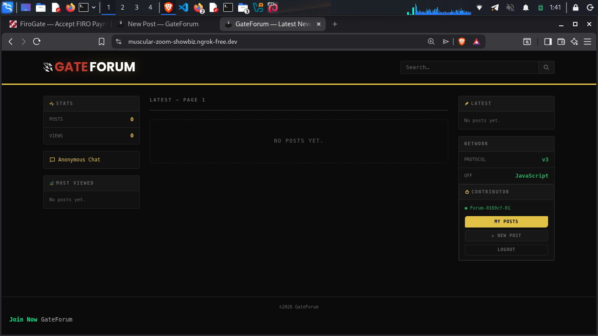
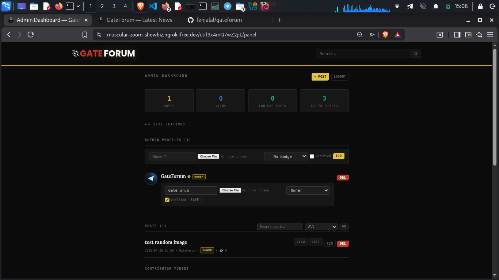

<div align="center">

# GateForum

**Anonymous · Privacy-First · Self-Hosted Forum & Publishing Platform**

Built for Tor hidden services and clearnet alike.  
Zero tracking. Zero ads. Zero external connections.

[](https://python.org)
[](https://flask.palletsprojects.com)
[](#license)
[](#)

> Created by **Fen & ai**

</div>

---

## What is GateForum?

GateForum is an open-source, self-hosted anonymous publishing platform and forum. It is designed to run on **Tor hidden services** (.onion) and **clearnet** simultaneously without any configuration changes.

**Key principles:**
- No JavaScript required for reading
- No external fonts, CDNs, or third-party requests of any kind
- No visitor logs or tracking
- Contributors verify their identity with **Firo cryptocurrency** (FIRO) — one-time payment, permanent verified badge
- Self-hosted image CAPTCHA — no reCAPTCHA, no hCaptcha

---

## Features

| Feature | Details |
|---|---|
| **Dual-network** | Works on Tor `.onion` and clearnet automatically |
| **Verified badges** | Contributors pay 3.99 FIRO once to get a permanent badge |
| **FiroGate integration** | Privacy-preserving Firo cryptocurrency payment gateway |
| **Self-hosted CAPTCHA** | Python/Pillow image CAPTCHA — no external service |
| **Smart feed** | 70% news posts + 30% random — no algorithm bias |
| **Markdown** | Bold, italic, code blocks, headings, auto-links |
| **Token system** | Admin-generated access keys for contributors |
| **Self-registration** | Users can create accounts with CAPTCHA |
| **Anonymous chat** | Built-in real-time chat with no accounts required |
| **Image uploads** | Up to 6 images per post, shown in responsive grid |
| **Role badges** | Reporter · Editor · Analyst · Hacktivist · Moderator · and more |
| **Admin panel** | Hidden URL — only you know the path |
| **Rate limiting** | Built-in per-IP rate limiting — no Redis required |
| **XSS protection** | All content escaped before rendering |
| **Security headers** | CSP · X-Frame-Options · Referrer-Policy on every response |

---

## Requirements

| Requirement | Minimum Version |
|---|---|
| Python | 3.10 or newer |
| pip | Any recent version |
| Pillow | 10.0+ (for CAPTCHA images) |
| Tor | 0.4.7+ (optional — for .onion hosting) |
| RAM | 128 MB minimum |
| Disk | 100 MB + space for uploads |

**Supported OS:** Debian · Ubuntu · Arch · Termux (Android) · Any Linux

---

## Quick Start

### 1. Clone the repository

```bash
git clone https://github.com/fenjalal/gateforum.git
cd gateforum
```

### 2. Install dependencies

```bash
pip install -r requirements.txt
```

On Termux or systems with PEP 668:
```bash
pip install -r requirements.txt --break-system-packages
```

For Tor support (optional):
```bash
pip install requests[socks]
```

### 3. Set up admin password

Run **once only**:
```bash
python3 setup_password.py
```

This generates your `DNet_FERNET_KEY` and `DNet_ADMIN_BLOB` and saves them to `.env`.

> ⚠️ **Never commit `.env` to any repository. It contains your admin password.**

### 4. Configure `.env`

Open `.env` and fill in the required values:

```env
# Generated by setup_password.py — do not change manually
DNet_FERNET_KEY=...
DNet_ADMIN_BLOB=...

# Change these — they form your secret admin panel URL
DNet_ADMIN_PREFIX=your_random_word
DNet_ADMIN_SUFFIX=your_other_random_word

# Server
DNet_HOST=127.0.0.1
DNet_PORT=5000

# FiroGate payment gateway (required for verified badges)
FIROGATE_API_KEY=fgate_your_key_here
FIROGATE_WEBHOOK_SECRET=your_webhook_secret

# Your site's public URL (required for payment redirects)
# Tor:      SITE_BASE_URL=http://yourxxxxxxxx.onion
# Clearnet: SITE_BASE_URL=https://yourdomain.com
SITE_BASE_URL=

# Optional Tor proxy for FiroGate requests
FIROGATE_USE_TOR=0
FIROGATE_TOR_PROXY=socks5h://127.0.0.1:9050
```

### 5. Run the database migration

```bash
python3 migrate.py
```

### 6. Start the server

**Production:**
```bash
bash start.sh
```

**Development:**
```bash
bash start_dev.sh
```

---

## Tor Hidden Service Setup

### Debian / Ubuntu

```bash
sudo apt install -y tor

# Append hidden service config
sudo bash -c 'cat torrc.snippet >> /etc/tor/torrc'
sudo systemctl restart tor

# Get your .onion address
sudo cat /var/lib/tor/gateforum_hidden_service/hostname
```

### Termux (Android)

```bash
pkg install tor
echo "HiddenServiceDir $HOME/.tor/gateforum/" >> $PREFIX/etc/tor/torrc
echo "HiddenServicePort 80 127.0.0.1:5000" >> $PREFIX/etc/tor/torrc
tor &
sleep 5
cat ~/.tor/gateforum/hostname
```

Then add your `.onion` address to `.env`:
```env
SITE_BASE_URL=http://yourxxxxxxxxxxxxxxxx.onion
```

---

## Admin Panel

Your admin panel URL is:
```
http://yoursite.onion/<DNet_ADMIN_PREFIX>/<DNet_ADMIN_SUFFIX>
```

Default (change this immediately):
```
http://127.0.0.1:5000/ctrl9x4mQ7wZ2pL/auth8nK3vR6hJ1sT
```

**Admin capabilities:**

| Action | Description |
|---|---|
| Publish posts | Title + body (markdown) + up to 6 images + author + role |
| Pin posts | Up to 3 pinned posts always shown at top |
| Manage authors | Create/edit/delete author profiles with avatars |
| Generate tokens | Issue access keys for contributors |
| Revoke tokens | Instantly block a contributor |
| Grant verified badge | Manually verify any contributor |
| Site settings | Title, tagline, posts per page, maintenance mode |
| Activity log | Full audit trail of all admin actions |

---

## Contributor System

### How it works

1. **Admin generates a token** → Dashboard → Contributor Keys → Generate
2. **Share the key** with the contributor through a secure channel
3. **Contributor visits** `/token-access` and pastes the key
4. **Contributor gets verified** by paying 3.99 FIRO via FiroGate
5. **Contributor publishes** posts with their verified badge

### Self-registration

Users can also create their own accounts at `/register` using a CAPTCHA. They still need to pay 3.99 FIRO to unlock posting.

### Contributor permissions

| Action | Contributor | Admin |
|---|---|---|
| Read posts | ✅ | ✅ |
| Publish posts | ✅ (verified only) | ✅ |
| Delete own posts | ✅ | ✅ |
| Delete any post | ❌ | ✅ |
| Manage tokens | ❌ | ✅ |
| Manage authors | ❌ | ✅ |
| Admin panel access | ❌ | ✅ |

---

## Verified Badge & FiroGate

GateForum uses [FiroGate](https://firogate.com) as a privacy-preserving Firo (FIRO) payment gateway.

**How verification works:**
1. User clicks "Pay to Verify" 
2. Backend creates a payment via FiroGate API
3. Ex: User pays 3.99 FIRO to the generated address
4. FiroGate sends a webhook to `/webhook/firogate`
5. Backend verifies HMAC signature and grants the badge
6. Badge is permanent — stored in the database against the user's token

**The verified badge** is the same gold star SVG shown on all posts, the profile page, and the dashboard. It matches the badge the admin can grant manually.

---

## Project Structure

```
gateforum/
│
├── app.py                  ← Main Flask application
├── setup_password.py       ← Run once to set admin password
├── migrate.py              ← Database migration & repair tool
├── fix_verified.py         ← Grant verified badges manually
├── start.sh                ← Production start (Gunicorn)
├── start_dev.sh            ← Development start
├── requirements.txt        ← Python dependencies
├── torrc.snippet           ← Tor hidden service config snippet
├── .env                    ← Secrets (never commit this)
├── .gitignore              ← Git ignore rules
│
├── instance/
│   ├── DNet.db             ← SQLite database (auto-created, gitignored)
│   └── .secret_key         ← Flask secret key (auto-created, gitignored)
│
├── static/
│   ├── css/
│   │   ├── style.css       ← Main stylesheet
│   │   └── fonts.css       ← Local @font-face declarations
│   ├── fonts/              ← Local TTF fonts (zero external requests)
│   ├── uploads/            ← Post images (gitignored)
│   └── avatars/            ← Author avatars (gitignored)
│
└── templates/
    ├── base.html           ← Base layout
    ├── index.html          ← Home feed
    ├── post.html           ← Post detail
    ├── register.html       ← Self-registration with CAPTCHA
    ├── token_login.html    ← Login with access key
    ├── contributor_*.html  ← Contributor dashboard & profile
    ├── admin_*.html        ← Admin panel templates
    ├── verify_*.html       ← Payment verification flow
    ├── _byline.html        ← Author + verified badge partial
    ├── _post_card.html     ← Post card in feed partial
    └── ...
```

---

## Security

| Protection | Details |
|---|---|
| Rate limiting | 150 req/min pages · 30 req/min POST · per IP, in-memory |
| UA blocking | sqlmap, nikto, nmap, curl/wget scanners, 15+ patterns |
| Path blocking | `/.env` · `/.git` · `/wp-admin` · `/phpmyadmin` · 20+ paths |
| XSS | All user content HTML-escaped before markdown processing |
| CAPTCHA | HMAC-signed tokens — no session dependency, works on Tor |
| Webhook HMAC | SHA-256 signature + timestamp + nonce replay protection |
| CSP | `script-src 'self' 'unsafe-inline'` — no external scripts |
| Headers | `X-Frame-Options: DENY` · `Referrer-Policy: no-referrer` |
| File validation | Magic bytes checked — not just extension |
| Server-side sessions | Cookie is 64-byte random ID — no data in browser |
| Tor-aware guards | Header anomaly detection skips Tor Browser fingerprint |

---

## Upgrading

```bash
# 1. Back up data
cp -r instance/ instance_backup/
cp -r static/uploads/ uploads_backup/

# 2. Pull latest
git pull

# 3. Install new dependencies
pip install -r requirements.txt

# 4. Run migration
python3 migrate.py

# 5. Restart
bash start.sh
```

---

## Contributing

Pull requests are welcome. For major changes, open an issue first.

Please:
- Keep all processing server-side
- Never add external CDN dependencies
- Test on both Tor and clearnet
- Follow the existing code style

---

## License

Free to use, modify, and distribute. Attribution appreciated.

---

<div align="center">

**GateForum** — Open Source · freedom is key  
[GateForum Site](https://muscular-zoom-showbiz.ngrok-free.dev)  
*Built for privacy. Built for anonymity. Built to last.*

  


</div>